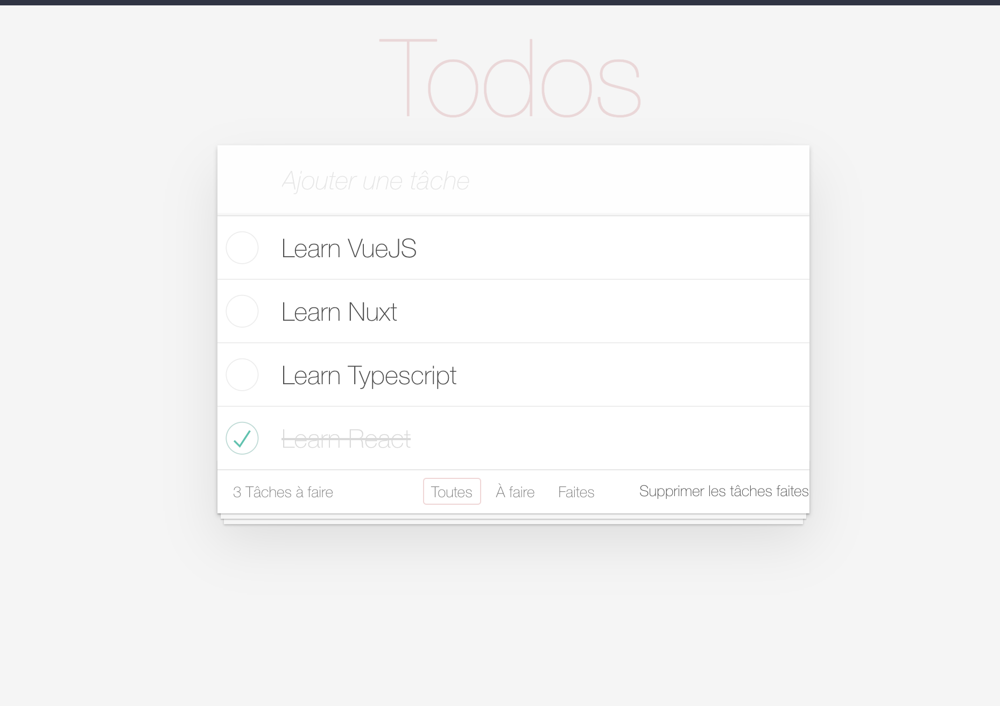

#  :heavy_check_mark: Todo App

## 👉 Create a Todo application with Vue.js 

## Illustration 📸



## Language/tools 🛠
- HTML5 / CSS3
- Javascript / Vue.js 

  

## Goals 🏔
- Discover Vue.js / new Javascript Framework


## How to use ⚙️

### 🔗 Launch the development server & meeting on http://localhost:8080/

### Project setup
```
yarn install
```

### Compiles and hot-reloads for development
```
yarn serve
```

### Compiles and minifies for production
```
yarn build
```

## Status 📈
Project completed

## Context 🎓
Project developed as a junior web developer
